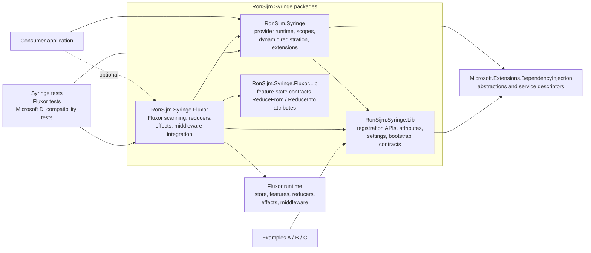
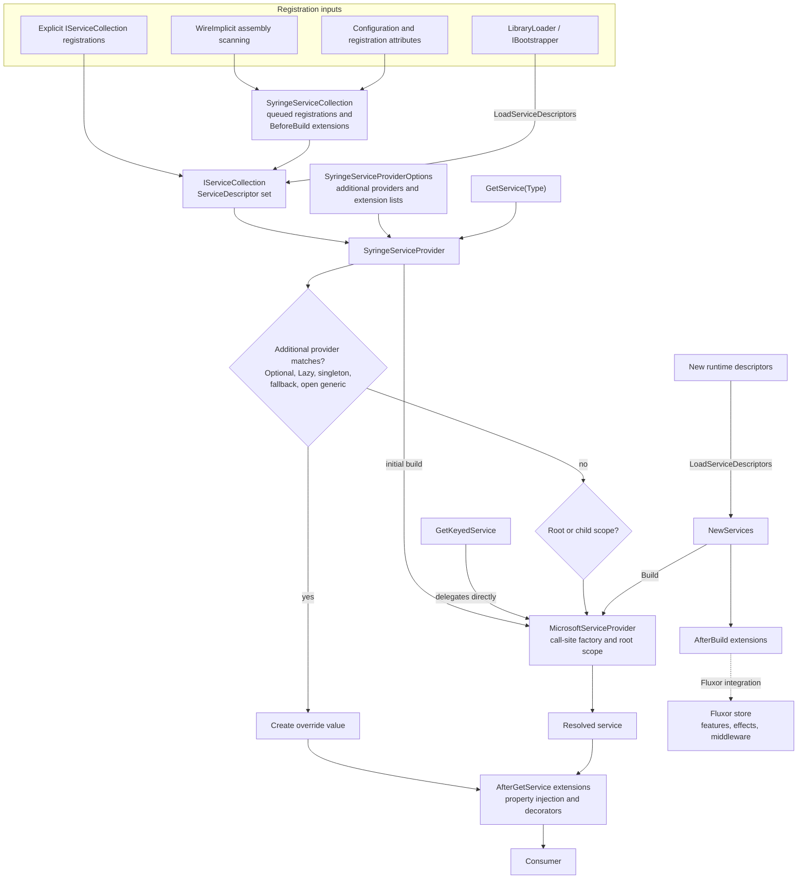

# Architecture

RonSijm.Syringe extends `Microsoft.Extensions.DependencyInjection` in two layers:

- `RonSijm.Syringe.Lib` defines registration APIs, metadata, and lightweight contracts.
- `RonSijm.Syringe` provides the dynamic service-provider runtime and its extension pipeline.

Fluxor support follows the same split. `RonSijm.Syringe.Fluxor.Lib` contains state-related
contracts and attributes, while `RonSijm.Syringe.Fluxor` contains the runtime integration.

## Component view

## Runtime view

## Key design points

- Implicit registration is reflection-based and produces standard Microsoft DI
  `ServiceDescriptor` instances.
- The custom provider retains the Microsoft DI call-site engine, then adds runtime descriptor
  loading, custom scopes, special-type providers, and extension hooks around it.
- `LoadServiceDescriptors` stages new registrations. `Build` adds them to the existing call-site
  factory and invalidates stale accessors without replacing existing scopes.
- Resolution extensions run after a service is created. Build extensions receive the descriptors
  added by each build and can integrate them with external runtimes such as Fluxor.
- The `*.Lib` projects keep contracts usable by libraries without requiring the corresponding
  runtime package.
